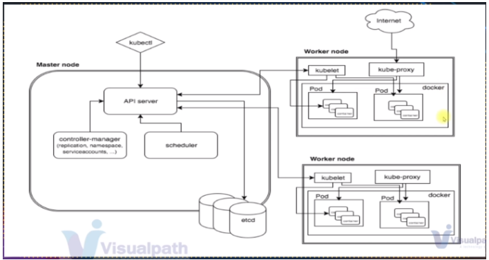
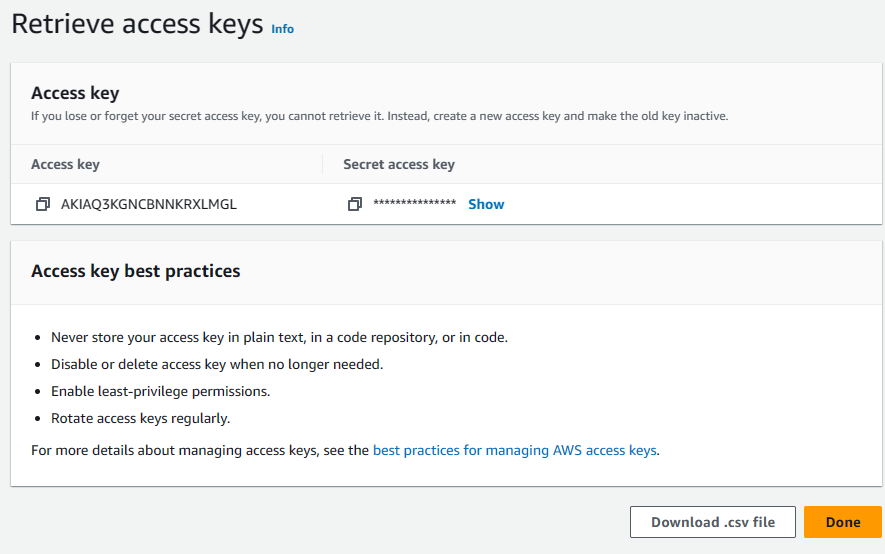
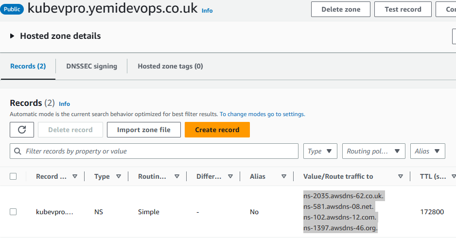
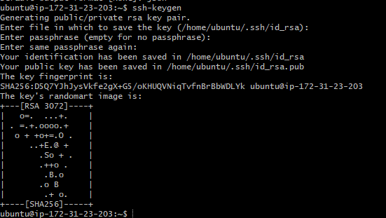
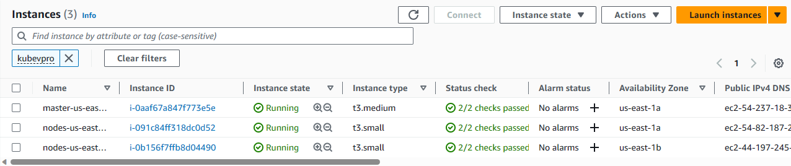
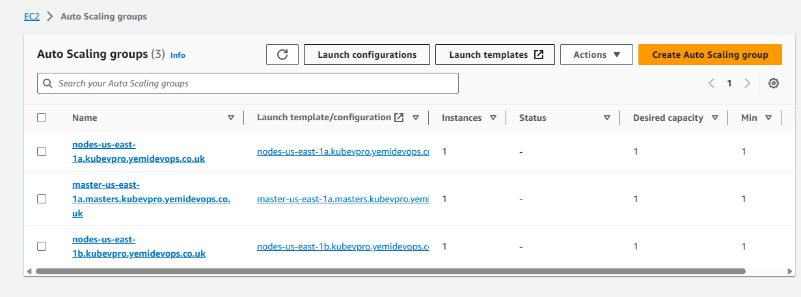
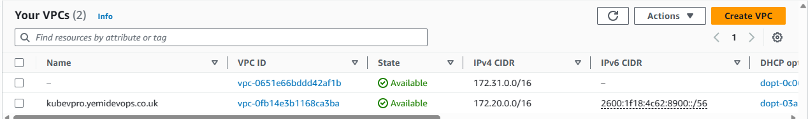

# Project-15: Kubernetes Setup For Production (Kops for Clusters On Aws)

[*Project Source*](https://www.udemy.com/course/decodingdevops/learn/lecture/31935616#overview)




## Pre-requisites:
* Domain name for Kubernetes DNS Records.
* AWS service or VM


## Steps!

- Launch an Ec2 instance with the details below
```sh
Name: Kops
AMI: Ubuntu 22.04
SecGrp: kops-sg
Ingress: Port 22 allowed from "my IP" or "anywhere"
InstanceType: t2.micro
KeyPair: kops-key.pem
```

- Create an S3 bucket with details below to store the state of Kops so we can run our Kops command from anywhere as long as it is pointed to our s3 bucket.
```sh
Bucketname: Vprofile-kops-state25
```

- Create an IAM user for our awscli with details below
```sh
Username: Kopsadmin
Attach policies: Adminstrator Access

(Be sure to download the csv file)
```



- Create Hosted Zone in Route53 with details below
```sh
Domain Name: kubevpro.<yourdomain-name.com>
```

- Add the NameServer URL to your domain registry.
 


- Now that we have our IAM user, S3 bucket and Domain setup, we can login and configure our ec2 instance.
- Log in to your ec2 instance and generate ssh-key which would be used by our Kops.
- Install and configure aws cli with commands below

```sh
sudo apt update && sudo apt install awscli -y
aws configure
then add the aws access key and secret key you already created and downloaded alongside your ec2 instance region.
Output "Json"
```



- Next, Install and setup Kubectl with commands from the documentation link here https://kubernetes.io/docs/tasks/tools/install-kubectl-linux/ 
```sh
curl -LO "https://dl.k8s.io/release/$(curl -L -s https://dl.k8s.io/release/stable.txt)/bin/linux/amd64/kubectl"
chmod +x ./kubectl
sudo mv kubectl /usr/local/bin/
```

- Next, install Kubernetes with Kops with documentation link here https://github.com/kubernetes/kops/releases . Navigate to v1.25.4 > Assets > kops-linux-amd64, then right click to copy the link.

```sh
wget https://github.com/kubernetes/kops/releases/download/v1.25.4/kops-linux-amd64
ls
chmod +x kops-linux-amd64
sudo mv kops-linux-amd64 /usr/local/bin/kops
```

- Verify Domain with the command below
```sh
nslookup -type=ns kubevpro.<yourdomain-name.com>
```


- Now we are going to run Kops command that will create our Kubernetes cluster with details below
```sh
kops create cluster --name=kubevpro.<domain name> \
  --state=s3://Bucketname \
  --zones=us-east-1a,us-east-1b \
  --node-count=2 --node-size=t3.small --master-size=t3.medium \
  --dns-zone=kubevpro.<domain name> \
  --node-volume-size=8 --master-volume-size=8
```


- Run the command below to update cluster, run this command whenever you make any change to your cluster.
```sh
kops update cluster --name kubevpro.<your domain> --state=s3://Bucket name --yes --admin
```


- Validate your cluster with command below
```sh
kops validate cluster --state=s3://vprofile-kops-state25
```


- Note: Kubectl uses cat ~/.kube/config to connect to the cluster.
- To view nodes, use the the command `<kubectl get nodes>`





- Clean up